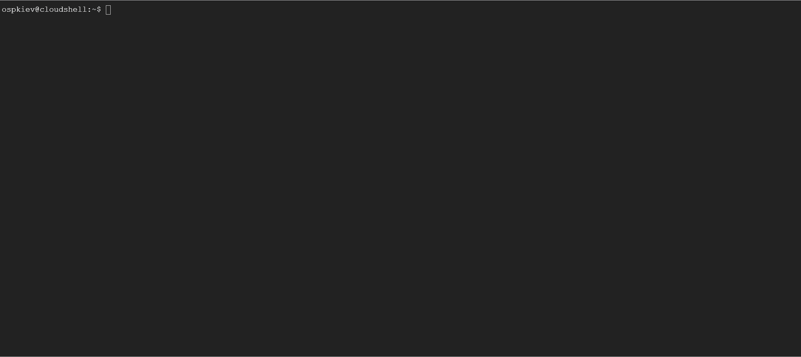

|                |                                                                                                                                           Minikube                                                                                                                                           |                                                                                                                                Kind                                                                                                                                 |                                                                                                                   K3d                                                                                                                    |
| :------------: | :------------------------------------------------------------------------------------------------------------------------------------------------------------------------------------------------------------------------------------------------------------------------------------------: | :-----------------------------------------------------------------------------------------------------------------------------------------------------------------------------------------------------------------------------------------------------------------: | :--------------------------------------------------------------------------------------------------------------------------------------------------------------------------------------------------------------------------------------: |
|      Опис      | Minikube - це інструмент для локального розгортання і керування окремими Kubernetes кластерами. Він дозволяє розгортати один екземпляр Kubernetes на локальній машині для розробки, тестування та навчання без необхідності повноцінного хмарного або фізичного інфраструктурного середовища | Kind (Kubernetes in Docker) - це інструмент, який дозволяє створювати легкі локальні кластери Kubernetes, використовуючи Docker контейнери як вузли кластера. Основною метою Kind є спрощення розгортання і тестування Kubernetes за допомогою локальних середовищ. | K3s - це легкий і швидкий дистрибутив Kubernetes, спроектований спеціально для роботи в обмежених ресурсах, таких як IoT (Internet of Things) пристрої, розумний домашній обладнання або локальні середовища для розробки та тестування. |
| Характеристики |                             Підтримується на різних операційних системах, таких як Windows, macOS та Linux. Має можливості автоматизації за допомогою скриптів та конфігураційних файлів. Можливість використання додаткових плагінів для розширення функціоналу                             |                  Підтримується на різних операційних системах, таких як Windows, macOS та Linux. Простий у використанні та має можливості автоматизації через CLI та конфігураційні файли. Підтримує інтеграцію з Docker, що полегшує тестування.                   | Підтримується на різних операційних системах, таких як Windows, macOS та Linux. Має зручний CLI для автоматизації та швидкого створення кластерів Kubernetes. Швидке створення та тестування кластерів Kubernetes у Docker-контейнерах.  |
|    Переваги    |                                                                                                           Легкий у використанні. Добре документовано та підтримується спільнотою.                                                                                                            |                                                                                             Простий у використанні та налаштуванні. Інтеграція з Docker для тестування.                                                                                             |                                                             Швидке створення та тестування кластерів Kubernetes у Docker-контейнерах. Добра підтримка та активний розвиток.                                                              |
|    Недоліки    |                                                                                                                    Обмежена підтримка для розгортання більших кластерів.                                                                                                                     |                                                                                                        Обмежена підтримка для розгортання більших кластерів.                                                                                                        |                                                                                       Може бути складним для новачків через розширені можливості.                                                                                        |

Висновки:\
Рекомендую використовувати інструмент k3d для розгортання локального Kubernetes кластеру для PoC стартапу "AsciiArtify". K3d має швидку та просту у використанні конфігурацію та надає можливість швидко створювати та тестувати кластери Kubernetes у Docker-контейнерах.

Демонстрація:
Minikube \

Kind \

K3d \

